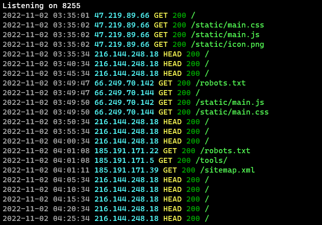

# cyber-express-logger
A simple and colourful request logger for Express



## Installation
Just use npm:
```
npm i cyber-express-logger
```

## Usage
The module exports a single, default function.

### Default function `logger(opts?)`:
* Object `opts`:
    * Callback `getIP(req):string`  
    Returns the client's IP address given the request object. This should be used when, for example, you use a proxy like Cloudflare and want to get the user's actual IP.

## Example
```js
// Require modules
const express = require('express');
const logger = require('cyber-express-logger');

// Create express server
const srv = express();

// Set up logger
// Make sure this appears before any other request handlers
srv.use(logger({
    getIP: req => req.header['cf-connecting-ip'] // Use this to get the client's IP
}));

// ... Your request handlers ...

// Listen
const port = 8080;
srv.listen(port, () => console.log(`Listening on ${port}`));
```